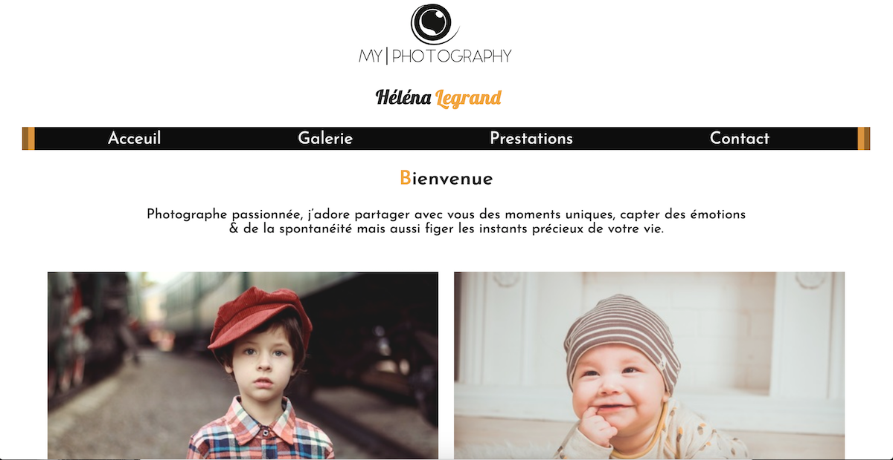

# livraison3 / site photographe bébé (dans le cadre d'un exercice pour ma formation) niveau à 1 mois sur 8 mois de formation

Le but de l'exercices etait de faire un site pour une photographe bébé.
Les téchno autorisé pour l'exercice HTML/CSS  site statique
******

En formation avec l'organisme Simplon et Yes We Web pour devenir un futur devellopeur Web

